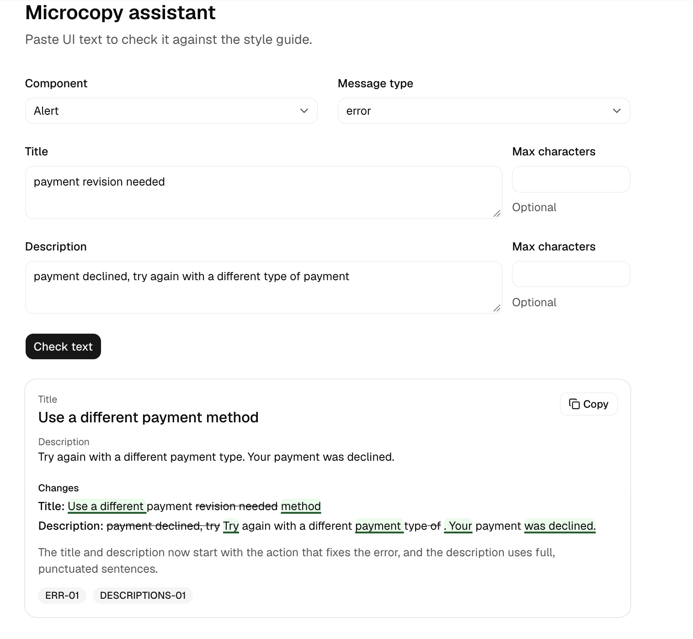
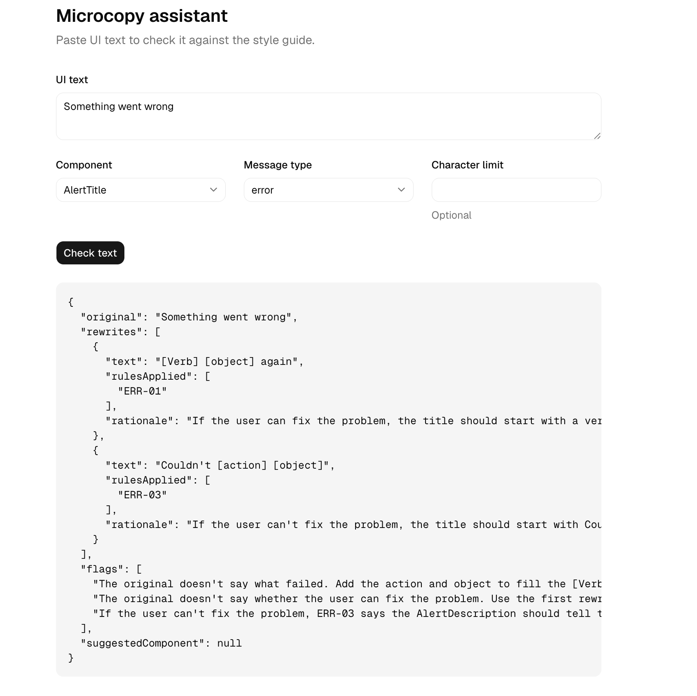

# Microcopy assistant

An AI assistant that rewrites UI text against a UI text style guide and cites the rule behind every change.



**Live demo:** [microcopy-assistant.vercel.app](https://microcopy-assistant.vercel.app/) (access code in the case study) · **Case study:** coming soon

## What it does

- **Rewrites against your rules, not the model's taste.** The style guide is a set of numbered rules, and the assistant applies only those.
- **Explains every change.** Each rewrite lists the rules that caused it, such as `ERR-01` or `BUTTONS-01`. A rewrite with no rule behind it isn't allowed.
- **Flags what it can't know instead of guessing.** If an error message doesn't say what failed, the assistant uses a placeholder like `Couldn't [failed action]` and says what's missing.
- **Reviews whole components.** A field's label, help text, and error text are checked together, the way they appear in the interface.
- **Suggests a better component** when the style guide calls for one, like turning an error toast into an alert.
- **Shows what changed** with a before-and-after view that doesn't rely on color alone.
- **Leaves good text alone.** When text already follows the rules, it says so.

## How it works

The style guide, prompt, and test set live in [`content/`](content/), separate from the app. The rules are the product; the interface is replaceable.

| File | What it holds |
|---|---|
| [`style-guide-rules.json`](content/style-guide-rules.json) | 19 rules, each with an ID, the components it applies to, and a do/don't example |
| [`system-prompt.md`](content/system-prompt.md) | Instructions for how to apply the rules |
| [`output-schema.json`](content/output-schema.json) | The shape every answer must follow |
| [`test-set.csv`](content/test-set.csv) | 30 test cases with ideal rewrites, expected rules, and expected flags |

The app in [`web/`](web/) is built with Next.js, Tailwind CSS, and shadcn/ui. It sends the rules and the text to Claude (Opus 5.5) and uses structured output, so every answer matches the schema. The schema requires at least one rule per rewrite, which makes an unexplained change impossible rather than unlikely. The rules and prompt are cached between requests, which cuts the cost of each request by about 60%.

## How it's tested

A test runner ([`web/scripts/run-tests.mts`](web/scripts/run-tests.mts)) sends all 30 cases to the app, three times each, because the same input can produce different answers. It checks:

- the rules Claude cited
- that correct text was left unchanged
- that a flag was raised when information was missing
- that the right component was suggested

It also writes a report with my ideal rewrite next to Claude's for every case, for the judgment calls a script can't make.

| Run | Cases passing every time |
|---|---|
| First run | 22 of 30 |
| After updating outdated tests and clarifying the prompt | 28 of 30 |
| After enforcing rules in the schema and clarifying two rules | 29 of 30 (the last case was fixed by clarifying `ERR-02`) |

A full run of 90 requests costs about $0.90. The reports are in [`notes/results/`](notes/results/).

Most failures weren't the model being wrong. They were tests written before a later decision, prompt examples that outweighed the instructions around them, or rules that were genuinely ambiguous to a human writer too. Each one is recorded in the decision log.



*An early version, before the answer was designed into cards.*

## Decision log

Every choice, the alternatives considered, and why: [`notes/decisions.md`](notes/decisions.md). It covers the stack, how the rules are structured, how the prompt evolved with test results, and the accessibility decisions behind the interface.

## Run it locally

You need Node.js 24 and an [Anthropic API key](https://platform.claude.com/).

```bash
cd web
npm install
```

Create `web/.env.local` with your key:

```
ANTHROPIC_API_KEY=your-key-here
```

Then start the app at http://localhost:3000:

```bash
npm run dev
```

With the app running, in another terminal from `web/`:

```bash
node scripts/run-tests.mts --runs 1
```

To check the rules file for mistakes:

```bash
python3 scripts/check-rules.py
```

(Run that one from the project root.)

## Project layout

```
microcopy-assistant/
├── content/        style guide rules, prompt, output schema, test set
├── notes/          decision log, test reports, screenshots, roadmap
├── scripts/        rules checker
└── web/            Next.js app and test runner
```

## Built with

[Claude API](https://platform.claude.com/) · [Next.js](https://nextjs.org/) · [Tailwind CSS](https://tailwindcss.com/) · [shadcn/ui](https://ui.shadcn.com/) with Base UI · [zod](https://zod.dev/) · [diff](https://github.com/kpdecker/jsdiff)
